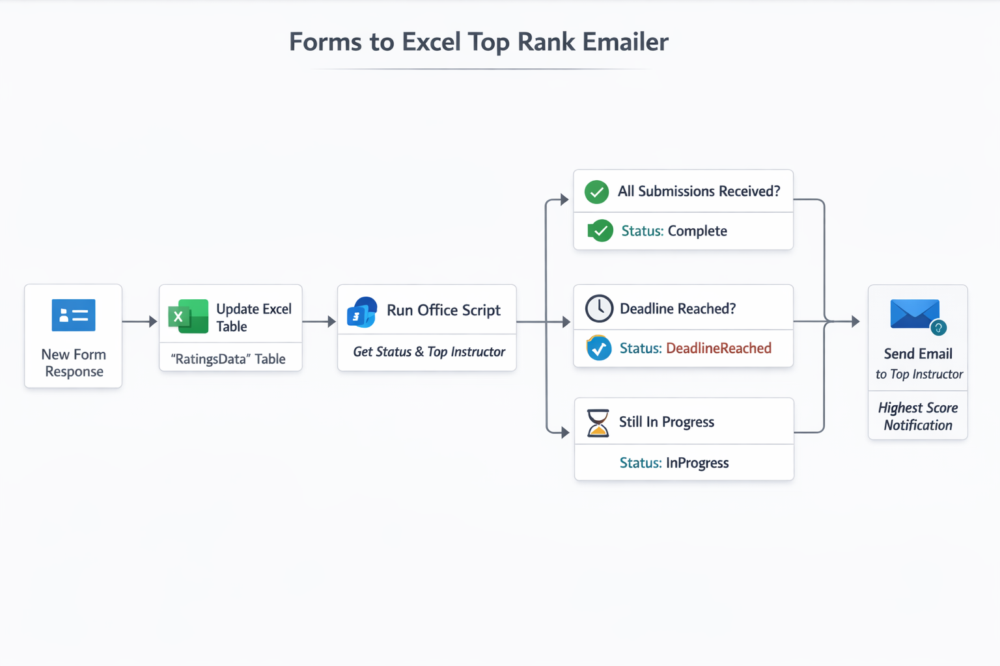

# SunilP-FormsToExcel-TopRankEmailer
Automated workflow for collecting evaluation responses, calculating the highest‑ranked instructor, and sending a notification email after:

✔ All submissions are received **before the deadline**, OR  
✔ The deadline has arrived (even if responses are incomplete).

This project integrates **Microsoft Forms → Excel → Office Scripts → Power Automate** to create a reliable, enterprise‑ready evaluation automation solution.

---
## ⬇️ Download

**Get the latest solution package (ZIP) from GitHub Releases:**

👉 [📦 Download Latest Release](https://github.com/spashikanti/SunilP-FormsToExcel-TopRankEmailer/releases/latest)

---

# 📘 Features

### ✅ Collect responses from Microsoft Forms  
Each form submission is automatically written into an Excel table.

### ✅ Admin-configurable evaluation logic  
Admin sets in Excel:
- **Expected number of submissions**
- **Deadline date/time**

### ✅ Intelligent flow outcome logic  
Office Script outputs one of three workflow statuses:

| Status             | Meaning |
|--------------------|---------|
| **Complete**       | All expected submissions received before deadline |
| **DeadlineReached**| Deadline passed; send results with available data |
| **InProgress**     | Waiting for more submissions and before deadline |

### ✅ Email automation  
Power Automate sends the email to the highest‑ranked instructor when:
- All submissions are in, OR  
- Deadline is reached (whichever happens first)

---

# 🧱 Solution Architecture

The automation follows a clear processing flow:

Microsoft Forms  
↓  
Excel (RatingsData Table)  
↓  
Office Script (Evaluation Status + Determines Top Instructor)  
↓  
Power Automate Flow (NotifyTopRankInstructor)  
↓  
Conditional Email (sent when Complete or DeadlineReached)  

This ensures that evaluations are processed consistently and only trigger notifications when the data is ready.

---

# 📊 Excel Structure

## Worksheet 1 — `RatingsData`
This sheet stores Microsoft Forms submissions.

| Column Name        | Description |
|--------------------|-------------|
| ParticipantEmail   | Email from form |
| Instructor         | Instructor evaluated |
| Score              | Numeric rating |
| Timestamp          | Submission time |

---

## Worksheet 2 — `Settings`
Admin-controlled configuration.

| Setting              | Value Example |
|----------------------|---------------|
| ExpectedSubmissions  | 20 |
| DeadlineDate         | 2026-03-31 23:59 |

⚠ **Admin may edit these values anytime.**

---

# 🧩 Office Script

Script name:  
### **`GetEvaluationStatusAndTopInstructor.ts`**

This script:
- Reads actual submissions  
- Reads expected submissions  
- Checks whether the deadline has passed  
- Computes the top instructor  
- Returns workflow status for Power Automate  

See script in `/office-scripts/GetEvaluationStatusAndTopInstructor.ts`.

---

# 🔁 Power Automate Flow (Packaged as a Solution)

The automation is packaged as a **Power Platform Solution**, which is the recommended and scalable way to share flows with the community. The solution includes:

- Cloud Flow: `NotifyTopRankInstructor`
- Environment Variables:
  - `FormId`
  - `ExcelFilePath`
  - `TableName`
  - `ScriptId`

This ensures:
- No tenant‑specific IDs inside the flow  
- Community users can import and update values easily  
- Clean, professional deployment  
- Compatible with ALM and GitHub practices

---

# 📦 Solution Import Guide

To use this automation in your environment:

## 1. Download the Solution
Download the latest release from GitHub:

👉 [📦 Latest Release](https://github.com/spashikanti/SunilP-FormsToExcel-TopRankEmailer/releases/latest)

The ZIP package contains the full Power Platform solution.

## 2. Import the Solution
1. Go to **Power Apps → Solutions**
2. Select **Import Solution**
3. Upload the ZIP file
4. During import, enter your values for these **Environment Variables**:
   - **FormId** → The Microsoft Form ID  
   - **ExcelFilePath** → Full path to your Excel file in SharePoint/OneDrive  
   - **TableName** → Name of the table in `RatingsData` sheet  
   - **ScriptId** → ID of the Office Script stored in Excel Online  

Your Excel file must match the structure provided under `/excel/SampleRatings.xlsx`.

## 3. Configure Connections
Reconnect the following connectors (required):
- Microsoft Forms  
- Excel Online (Business)  
- Office Scripts  
- Outlook (Send email)  

## 4. Test the Solution
Submit a test Microsoft Form response, then verify:
- A row appears in Excel  
- The Office Script returns the correct status  
- The flow sends an email when the expected logic is met  

---

# 🔁 Flow Logic Overview

1. Trigger: **When a new form response is submitted**  
2. Insert submission into the `RatingsData` Excel table  
3. Run Office Script to evaluate:
   - Submission count  
   - Deadline status  
   - Top instructor & top score  
4. Flow branches based on returned status:
   - **Complete** → Email sent  
   - **DeadlineReached** → Email sent  
   - **InProgress** → No action  

---

# 🖼 Flow Diagram

---

# 🗂 Repository Structure

SunilP-FormsToExcel-TopRankEmailer/  
│  
├── solution/  
│   └── FormsToExcelTopRankEmailer_.zip              # Importable Power Platform solution package 
│  
├── excel/  
│   └── SampleRatings.xlsx                           # Excel template with two sheets  
│  
├── office-scripts/  
│   └── GetEvaluationStatusAndTopInstructor.ts       # Office Script executed by flow  
│  
├── media/  
│   ├── flow-diagram.png                             # Architecture diagram  
│  
└── README.md  

---

# ▶️ How to Use

1. **Upload the Sample Excel file**
   Upload `/excel/SampleRatings.xlsx` to your SharePoint or OneDrive location.
   Update the `Settings` sheet with:
   - ExpectedSubmissions
   - DeadlineDate

2. **Import the Solution**
   Import the ZIP file located in `/solution`.

3. **Configure Environment Variables**
   Provide values for:
   - FormId
   - ExcelFilePath
   - TableName
   - ScriptId

4. **Rebind all required connectors**
   Power Automate will prompt for connection setup.

5. **Run a Test**
   Submit a Microsoft Form response.
   Validate:
   - Excel row is inserted
   - Script returns correct status
   - Flow emails the top instructor

---

# 🧪 Sample Workflow Scenarios

### ✔ Scenario A — All 20 submissions received before 2026‑03‑31  
Flow status = **Complete**  
→ Email sent immediately

### ✔ Scenario B — Only 12 submissions received by deadline  
Flow status = **DeadlineReached**  
→ Email still sent (with best available data)

### ✔ Scenario C — Ongoing, before deadline  
Flow status = **InProgress**  
→ No email sent

---

# 🛠 Optional Enhancements

- Email CC to program coordinator  
- Multi-instructor averaging  
- Multi-form consolidation  
- Teams notification instead of email  
- Storage in Dataverse instead of Excel  
- Power BI dashboard integration  

---

# 📄 License

This project is licensed under the **MIT License**, allowing personal and commercial use with attribution.

---

## 🤝 Community & Contribution

This solution was created to address a common challenge seen across the Power Platform community—automating evaluation workflows in a reliable, scalable way.

Contributions, ideas, and improvements are welcome.  
Open an Issue or submit a Pull Request to enhance the project.

---

# 🙌 Author

**Sunil Kumar Pashikanti**  
Principal Architect | Power Platform Contributor  
🌐 https://sunilpashikanti.com  
📝 Blog: http://sunilpashikanti.blogspot.com

